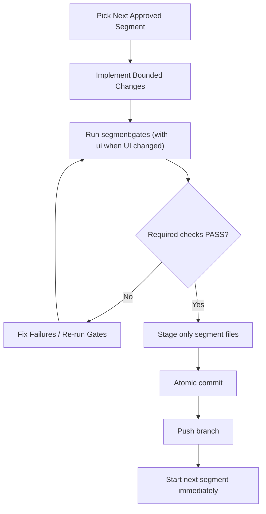

# Autonomous Codex Build System Blueprint

This is the portable operating blueprint for the autonomous coding setup currently running in this thread.

It captures only the structure and execution model. It intentionally excludes client identity, customer content, branded copy, and business-specific roadmap details.

## 1) Core Concept

The system is an **engineering execution loop** with explicit governance:

1. Engineer (Codex) implements one bounded segment.
2. Required gate agents run in deterministic order.
3. Machine-readable gate report is produced.
4. If required gates pass, engineer creates an atomic commit and pushes.
5. Next segment starts immediately.

No segment is considered complete without gate evidence.

## 2) Mission Statement Placement (Hard Requirement)

The exact mission statement is duplicated across control files and treated as a ship gate:

> "Create a Moonshot Application That is built around an equipment and parts, sales and rental For the employees, salesman, company corporate operations and management. Your sole function is to identify, design, and pressure-test transformational AI application ideas that are not fully possible today but will be unlocked by superintelligence."

### Mission is enforced in these files

- `AGENTS.md`
- `CLAUDE.md`
- `CODEX.md`
- `docs/mission-statement.md`
- `agents/registry.yaml` (`north_star_mission` + `mission_gate_rules`)

### Mission enforcement mechanics

- Every segment must carry a mission alignment verdict (`pass|risk|fail`) in reporting conventions.
- Any gate can block on mission misalignment.
- Waivers require owner, reason, expiry, remediation issue.

## 3) File/Folder Architecture You Reuse

```text
<repo>/
├─ AGENTS.md
├─ CLAUDE.md
├─ CODEX.md
├─ package.json
├─ docs/
│  ├─ mission-statement.md
│  └─ agent-gates-runbook.md
├─ agents/
│  ├─ README.md
│  ├─ registry.yaml
│  ├─ playbooks/
│  │  ├─ engineer-of-record.md
│  │  ├─ qa-agent.md
│  │  ├─ chief-design-officer-agent.md
│  │  ├─ testing-simulation-agent.md
│  │  ├─ security-rls-agent.md
│  │  ├─ performance-agent.md
│  │  ├─ migration-integrity-agent.md
│  │  └─ release-gate-agent.md
│  ├─ templates/
│  │  ├─ segment-handoff.md
│  │  └─ gate-report.md
│  └─ schemas/
│     └─ gate-report.schema.json
├─ scripts/
│  ├─ check-migration-order.mjs
│  └─ agent-gates/
│     └─ run-segment-gates.mjs
├─ .agents/
│  ├─ design-review-runner.js
│  ├─ design-review.spec.js
│  └─ stress-test/run.ts
└─ test-results/
   └─ agent-gates/
      └─ <timestamp>-<segment>.json
```

## 4) Runtime Roles (Agent Registry Model)

Defined in `agents/registry.yaml` with:

- `default_gate_order`
- per-agent `mandatory_when`
- `trigger_rules`
- expected outputs
- pass criteria
- linked playbook path

### Current gate order

1. `engineer`
2. `qa_agent`
3. `cdo_agent`
4. `chaos_agent`
5. `security_agent`
6. `performance_agent`
7. `migration_agent`
8. `release_gate_agent`

### Required role purposes

- **Engineer of Record**: implements segment and produces handoff.
- **QA Agent**: acceptance/regression/device checks.
- **Chief Design Officer Agent**: external UI/copy quality gate.
- **Testing/Simulation Agent**: chaos/stress/failure-path validation.
- **Security/RLS Agent**: auth/workspace/secret/audit safety.
- **Performance Agent**: bundle/render/query budget protection.
- **Migration Integrity Agent**: sequence and rollback discipline.
- **Release Gate Agent**: GO/NO_GO aggregator.

## 5) Deterministic Gate Runner (How It Actually Executes)

Implemented in `scripts/agent-gates/run-segment-gates.mjs`.

### CLI

```bash
bun run segment:gates --segment "<segment-id>" [--ui] [--no-chaos] [--design-advisory]
```

### What it runs

1. `qa.migration-sequence` -> `bun run migrations:check`
2. `qa.root-build` -> `bun run build`
3. `qa.web-build` -> `bun run build` in `apps/web`
4. `chaos.stress-suite` -> `bun run stress:test` (unless `--no-chaos`)
5. `cdo.design-review` -> `bun run design:review` (when `--ui`)

### Verdict logic

- Any failed **required** check => overall `FAIL`.
- Otherwise => `PASS`.
- Report written to `test-results/agent-gates/<timestamp>-<segment>.json`.

### Report shape

- Segment id, timestamp, verdict
- Per-check status, command, duration, output
- Summary counts and blocking failures
- Artifact paths (e.g., screenshots/report JSON)

Schema contract is in `agents/schemas/gate-report.schema.json`.

## 6) Required Package Scripts

Root `package.json` scripts that make autonomy repeatable:

- `dev`
- `build` (includes migration check)
- `build:web`
- `migrations:check`
- `design:review`
- `stress:test`
- `segment:gates`

This keeps every segment on one shared command contract.

## 7) Migration Discipline Contract

Enforced by `scripts/check-migration-order.mjs`:

- Migration file name pattern: `NNN_snake_case_name.sql`
- 3-digit numeric prefix
- No duplicates
- Contiguous sequence from `001..N` (no gaps)

If violated, build gates fail early.

## 8) UI/Design Gate Automation Pattern

Implemented by `.agents/design-review-runner.js` (current implementation may use a project-specific filename prefix; normalize when porting):

- Playwright headless run
- Multi-viewport snapshots: 375, 768, 1024, 1440
- Role-based route checks (privileged + restricted user paths)
- Writes artifacts to `/tmp/*`
- Writes a machine-readable report (path can be standardized to `/tmp/design-review-report.json`)

Portable pattern:

- Keep env-configurable base URL and credentials.
- Test key screens and permission redirects.
- Capture both screenshots and measurable UI markers.

## 9) Chaos/Simulation Gate Pattern

Implemented by `.agents/stress-test/run.ts`:

- Standalone logic simulation (no browser required)
- Produces `PASS|FAIL|ADVISORY` lines
- Exits non-zero on hard failures

Portable pattern:

- Model your state machines and parsers directly.
- Include concurrency, malformed payload, boundary, and recovery tests.
- Keep advisories as non-blocking but visible risk debt.

## 10) Segment Lifecycle (Autonomous Loop)



## 11) Commit/Push Discipline

Observed discipline from active execution:

- Commit only files for the completed segment (atomic slices).
- Keep unrelated in-flight work out of the commit.
- Use descriptive conventional commit messages (`feat:`, `fix:`, `chore:`).
- Push after gate pass, then proceed to next segment.

## 12) What To Replace For A New Application

When porting, keep structure, replace project-specifics:

1. Mission text in:
   - `AGENTS.md`
   - `CLAUDE.md`
   - `CODEX.md`
   - `docs/mission-statement.md`
   - `agents/registry.yaml`
2. Design runner page selectors, routes, and seeded data in `.agents/*design*`.
3. Stress suite scenarios in `.agents/stress-test/run.ts`.
4. Role names and permission expectations in:
   - `agents/registry.yaml`
   - playbooks
5. Migration conventions only if your DB strategy differs.
6. Build commands in `package.json` only if stack differs.

## 13) Minimal Bootstrap Checklist (Copy This)

- [ ] Add mission files (`AGENTS.md`, `CLAUDE.md`, `CODEX.md`, `docs/mission-statement.md`)
- [ ] Add `agents/` registry, playbooks, templates, schema
- [ ] Add `scripts/check-migration-order.mjs`
- [ ] Add `scripts/agent-gates/run-segment-gates.mjs`
- [ ] Wire root scripts in `package.json`
- [ ] Add `.agents` design runner
- [ ] Add `.agents` stress runner
- [ ] Add `docs/agent-gates-runbook.md`
- [ ] Create `test-results/agent-gates/` output path
- [ ] Validate one dry-run segment end-to-end

## 14) Non-Negotiable Operating Rules

- No architecture reset mid-program without explicit approval.
- One segment at a time, one atomic commit at a time.
- No “done” status without gate artifact.
- Mission misalignment can block release even if tests pass.
- Security/workspace boundaries are validated as part of the gate model, not after release.

---

If you replicate exactly this structure and command contract, you can transplant the autonomous Codex operating model into a new repository without rebuilding the governance/gate framework from scratch.
