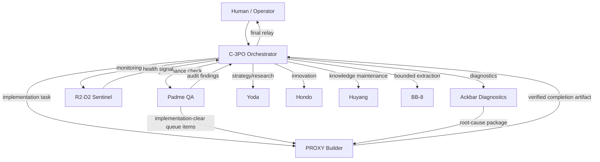

# Codex App Operating Structure

This document captures the reusable operating structure behind the current autonomous build setup without carrying over client-specific product copy, customer data, or branded business context.

It is based on the live evidence in:

- the product repo at `/Users/brianlewis/Projects/qep-knowledge-assistant`
- the OpenClaw runtime and workspaces under `/Users/brianlewis/.openclaw`
- the launchd scheduler surface under `/Users/brianlewis/Library/LaunchAgents`

## Scope

This document covers two layers:

1. the autonomous agent operating system
2. the application template those agents are building against

This document intentionally excludes:

- client names, branded assistant copy, and company-specific messaging
- customer records, CRM data, and secrets
- stale backups, placeholder workspaces, and historical experiments except where they explain the live architecture

## Executive Summary

The current system is not "one autonomous coder." It is a small operating system with:

- one front-door executive orchestrator
- specialized subordinate agents with narrow ownership
- a private-memory-per-agent model
- a shared publication layer for upward visibility
- a queue-based governance-to-implementation handoff
- timer-driven automations executed mostly through `launchd`
- a health/status layer that writes machine-readable JSON artifacts
- a product app repo built as a React + Supabase application

The reusable idea is:

- keep orchestration, governance, implementation, monitoring, diagnosis, strategy, innovation, knowledge, and extraction as separate lanes
- keep each lane small and opinionated
- force each lane to publish durable outputs in a standard shape
- treat code changes as only one lane in a larger closed loop

## Mission Layer

### System-level mission pattern

The system uses a top-level autonomy mission, shown most explicitly in `/Users/brianlewis/.openclaw/workspace-c3po-chief-of-staff/agent-outputs/mission-progress.md` and reinforced by the C-3PO mission in `/Users/brianlewis/.openclaw/workspace-c3po-chief-of-staff/SOUL.md`.

Reusable pattern:

- the system exists to run continuously
- reduce the human's routing burden
- find opportunities
- detect and fix problems
- create value while the human is not actively supervising

### Per-agent mission pattern

Every first-class agent is expected to have a `SOUL.md` with at least:

- `Mission`
- `Operating Rules`
- `What You Do`
- `What You Don't Do`

This matters because the mission is not only a slogan. It is part of the contract Padme audits and part of the role boundary other agents rely on.

### Mission progress loop

Mission work is not purely reactive. There is a proactive mission-improvement loop:

- template/report surface: `/Users/brianlewis/.openclaw/workspace-c3po-chief-of-staff/agent-outputs/mission-progress.md`
- shared skill: `/Users/brianlewis/.openclaw/workspace/skills/cron/mission-progress-proactive/SKILL.md`

Reusable pattern:

- choose one bounded, safe, reversible autonomy improvement
- execute it
- verify impact
- report the delta against the mission

## Runtime Topology

### Canonical roots

Live architecture is split across three roots:

- agent workspaces: `/Users/brianlewis/.openclaw/workspace-*`
- shared infrastructure: `/Users/brianlewis/.openclaw/shared-system`
- product app repos: separate code repos such as `/Users/brianlewis/Projects/qep-knowledge-assistant`

Important detail:

- `/Users/brianlewis/.openclaw/workspace` is a compatibility shell, not the authoritative C-3PO workspace
- the live chief-of-staff workspace is `/Users/brianlewis/.openclaw/workspace-c3po-chief-of-staff`
- shared materials were intentionally moved into `/Users/brianlewis/.openclaw/shared-system`

### Global runtime config

Primary runtime config lives in `/Users/brianlewis/.openclaw/openclaw.json`.

Reusable structure:

- agent registry
- default model routing and fallbacks
- image model routing
- sandbox defaults
- gateway config
- plugin toggles
- auth profiles
- secret providers

Observed live pattern:

- default primary model: `openai-codex/gpt-5.4`
- fallbacks include Claude, Gemini, Kimi, GPT-5.3 Codex, Codex Spark, GPT-5.4 Pro
- gateway mode is local with token auth and hot reload
- tools are globally restricted at the OpenClaw layer (`web` and `browser` denied by default)

### Root app guardrail

`/Users/brianlewis/.openclaw/AGENTS.md` is used as a root guardrail to force work onto the active product surface.

Reusable pattern:

- define one active app path
- define one legacy app path
- fail fast when someone works in the wrong surface

This is worth copying if you operate multiple generations of the same app.

## Standard First-Class Workspace Contract

Each live first-class agent workspace follows the same contract.

### Required local doctrine files

Typical required files:

- `AGENTS.md`
- `SOUL.md`
- `IDENTITY.md`
- `TOOLS.md`
- `USER.md`
- `HEARTBEAT.md`
- `MEMORY.md`
- `published/latest.md`
- `published/status.json`
- `published/open-loops.json`
- `published/decisions.json`

### Standard read order

Most workspaces define a startup/read order in `AGENTS.md`. The common pattern is:

1. `SOUL.md`
2. `IDENTITY.md`
3. `TOOLS.md`
4. optional `SKILLS.md`
5. `USER.md`
6. `HEARTBEAT.md`
7. `MEMORY.md`
8. `published/*`
9. recent `memory/` or `reports/` only if needed

### Memory model

The system separates:

- private working memory in the workspace
- published executive memory for parent-readable state

Private:

- `MEMORY.md`
- `memory/*.md`
- raw notes and role-specific continuity

Published:

- `published/latest.md`
- `published/status.json`
- `published/open-loops.json`
- `published/decisions.json`

### Publication mirror

Agent-local `published/` files are mirrored into:

- `/Users/brianlewis/.openclaw/shared-system/executive-memory/agents/<agent-id>/`

Shared contract is documented in:

- `/Users/brianlewis/.openclaw/shared-system/executive-memory/README.md`

Reusable rule:

- children publish upward
- parents read published state first
- siblings do not read each other's private workspaces by default

## Org Structure

### Live hierarchy

The live org tree from the inventory script is:

- C-3PO: executive front door
- BB-8: extraction utility lane
- Ackbar: diagnostics
- Huyang: knowledge graph / knowledge maintenance
- Hondo: innovation
- Padme: governance and QA
- PROXY: implementation
- R2-D2: monitoring
- Tom Lusk: external runtime contract lane
- Yoda: strategy and research

### Role map

| Theme Name | Generic Role | Runtime ID | Primary Function |
|---|---|---|---|
| C-3PO | Chief of Staff / Orchestrator | `c3po-chief-of-staff` | front door, prioritization, delegation, acceptance |
| Padme | Governance / QA Officer | `padme-hr-director` | audits doctrine, drift, org integrity, dispatches technical fixes |
| PROXY | CTO / Builder | `proxy_cto` | implements code, config, automation, skills, verification |
| R2-D2 | Sentinel / Monitoring | `r2d2_sentinel` | low-noise health checks and drift detection |
| Ackbar | Diagnostics / Incident Officer | `admiral_ackbar_cio` | root-cause analysis and remediation handoff |
| Yoda | Strategy / Research | `yoda_worker` | deep synthesis, option comparison, research |
| Hondo | Innovation Officer | `hondo_ohnaka_cino` | opportunity discovery and normalization |
| Huyang | Knowledge Officer | `cko_knowledge` | entity graph, linkage, knowledge hygiene |
| BB-8 | Utility Extraction Lane | `action_extractor` | structured extraction from bounded inputs |
| Tom | External product/runtime lane | `tom_lusk_coo` | separate external-user runtime contract |

### Recommended reusable version

For a new application, port the role pattern, not the themed names:

- orchestrator
- governance/QA
- implementation
- monitoring
- diagnostics
- strategy/research
- innovation
- knowledge maintenance
- utility extraction
- optional external/customer-facing contract lane

## Model Assignment Pattern

Model choice is role-specific, not universal.

Observed live pattern:

| Role | Observed model posture |
|---|---|
| C-3PO | orchestration lane historically tied to GPT-5.3 Codex, with runtime default now pointing to GPT-5.4 |
| Padme | Claude-heavy governance lane |
| PROXY | Claude-heavy implementation lane |
| Ackbar | Claude-heavy diagnostics lane |
| Yoda | Gemini long-context research lane |
| Hondo | Gemini innovation lane |
| R2-D2 | Kimi monitoring lane |
| BB-8 | Kimi extraction lane |
| Huyang | Haiku-scale knowledge maintenance lane |

Important structural lesson:

- model assignment lives in more than one place
- runtime defaults, `SOUL.md`, and `IDENTITY.md` can drift
- governance must audit model-role fit

Do not hardcode model truth in only one file unless you are prepared to enforce that centrally.

## Work Routing And Closed-Loop Execution

### Normal path

### Core routing rules

From the doctrine:

- C-3PO is the only front door
- Brian should not need to know which lane owns a fact
- C-3PO reads published state first
- lower agents publish upward
- PROXY builds
- Padme audits and routes technical follow-through
- Ackbar diagnoses but does not become the builder
- R2 stays quiet unless there is durable signal

### Completion contract

Every subordinate lane has an explicit completion contract with C-3PO.

Typical required completion payload:

- what changed or what was diagnosed
- what was verified
- what remains open or blocked
- who owns the next step
- what the human should be told, if anything

This is one of the most reusable parts of the architecture. It prevents "task finished but nobody knows what happened."

## Governance And QA Loop

### Padme's role

Padme is the structural QA lane.

She audits:

- workspace contract compliance
- reporting chain integrity
- publication freshness
- automation drift
- role drift
- model drift

Padme is allowed to:

- fix low-risk documentation drift directly
- route implementation-clear technical work to PROXY

Padme is not allowed to:

- silently rewrite org design
- silently change ownership or reporting lines

### Dispatch contract

Padme hands implementation-ready work to PROXY through:

- queue spec: `/Users/brianlewis/.openclaw/shared-system/specs/padme-to-proxy-dispatch-contract.md`
- queue file: `/Users/brianlewis/.openclaw/shared-system/executive-memory/agents/proxy_cto/dispatch-queue.json`

Reusable dispatch fields:

- `dispatch_id`
- `status`
- `priority`
- `category`
- `title`
- `summary`
- `source_finding`
- `scope_allowed`
- `scope_forbidden`
- `evidence`
- `acceptance_criteria`
- `verification_steps`
- `notes_for_proxy`
- `blocked_reason`
- `completed_at`

### Dispatch behavior

Padme rules:

- only dispatch implementation-clear items
- limit batch size
- include evidence and acceptance criteria

PROXY rules:

- read queue first
- process only bounded work
- set blocked/done states explicitly
- reflect results in executive publications

This is the current "code goes through quality assurance and then execution" mechanism.

## Implementation Lane

### PROXY's job

PROXY is the dedicated implementation officer.

Owned work:

- code changes
- config changes
- cron and launchd repair
- workspace bootstrap repair
- skill creation and updates
- technical verification
- concise implementation handoff

Important rule:

- PROXY is expected to build and verify, not just plan

### Shared-vs-local skill model

PROXY has a role-specific routing catalog in:

- `/Users/brianlewis/.openclaw/workspace-proxy_cto/SKILLS.md`

But the heavy lifting mostly lives in the shared substrate:

- `/Users/brianlewis/.openclaw/workspace/skills`

Reusable pattern:

- keep the role-specific skill catalog thin and stable
- back it with shared implementation skills that many lanes can reuse

### Daily implementation sweep

Shared cron skill:

- `/Users/brianlewis/.openclaw/workspace/skills/cron/proxy-implementation-sweep/SKILL.md`

Behavior:

1. read dispatch queue first
2. if empty, inspect latest Padme artifacts
3. execute only bounded technical work
4. verify each change
5. update publication and queue status

This is the main bridge between governance findings and applied code/config work.

## Monitoring And Diagnostics Separation

### R2-D2

R2 owns fast, low-noise monitoring.

Default skill:

- `/Users/brianlewis/.openclaw/workspace-r2d2_sentinel/skills/r2-sentinel-scan/SKILL.md`

Checks:

- gateway health
- channel health
- PM2 and launchd health
- publication freshness
- incident classification

Output rule:

- return `HEARTBEAT_OK` when green
- publish only durable yellow/red signal

### Ackbar

Ackbar owns diagnosis after signal appears.

Reusable split:

- monitoring lane says "something is wrong"
- diagnostics lane says "what is wrong and what exact fix should happen next"
- implementation lane applies the fix

This separation is strong and should be preserved.

## Strategy, Innovation, Knowledge, And Extraction Lanes

### Yoda

Use for:

- strategy
- research
- synthesis
- option comparison
- bounded proof work

Standing recurring duty is intentionally small:

- one daily skill discovery lane

### Hondo

Use for:

- opportunity discovery
- idea normalization
- implementation-ready innovation briefs

Not for:

- final prioritization
- execution

### Huyang

Use for:

- local graph/entity maintenance
- conservative entity extraction
- relationship rebuilding
- knowledge hygiene

This is a maintenance lane under the executive system, not the product app's user-facing chat layer.

### BB-8

Use for:

- bounded extraction
- task/fact/decision/recap extraction from transcripts or small conversation slices

Important pattern:

- utility lanes can be first-class without becoming decision-makers

## Automation Architecture

### Scheduler split

The system currently has two scheduling surfaces:

1. `cron/jobs.json` as registry and historical contract
2. `launchd` as the real executor for many active jobs

This means:

- many jobs are disabled in `jobs.json`
- the disabled job still holds metadata, expected cadence, host command, and status target
- launchd calls a wrapper that executes the job and writes fresh status JSON

### Job wrappers

Main wrappers:

- host job wrapper: `/Users/brianlewis/.openclaw/scripts/reliability/run-host-job.mjs`
- sweep wrapper: `/Users/brianlewis/.openclaw/scripts/reliability/run-sweep.mjs`

Reusable pattern:

- keep human-readable job metadata in one registry
- keep actual execution in scheduler-native jobs
- write normalized status JSON after each run
- escalate failures through a central helper, not per-job custom logic

### Health output contract

Status files are written into:

- `/Users/brianlewis/.openclaw/shared-system/health/...`

Observed groups:

- per-agent/per-job health JSON
- sweep JSON and markdown
- usage JSON
- dead-letter log

This is the machine-readable observability layer the system uses after the job fires.

### Reliability sweeps

`run-sweep.mjs` groups jobs into logical reliability bundles:

- `infra_proxy`
- `governance_hygiene`
- `executive_drift`
- `tom_guardian`

Reusable pattern:

- do not only monitor individual jobs
- also monitor groups of jobs and freshness of the group's status artifacts

### Current live examples

Observed launchd jobs include:

- Padme nightly audit
- infra + proxy sweep
- proxy email-sync-worker health check
- proxy API key rotation tracker
- R2 daily sentinel scan
- Ackbar jarvis-api stability check
- Hondo nightly innovation
- Hondo idea normalization
- Huyang nightly maintenance
- Huyang weekly audit
- governance hygiene sweep
- executive drift sweep
- Tom guardian sweep

### Important live drift to avoid cloning blindly

The current system has some scheduler drift:

- many doctrine files still describe old cron timing while live execution moved to `launchd`
- some job labels are missing in `jobs.json`
- some expected recurring lanes have no active automation
- Yoda is explicitly expected to have a daily lane, but the inventory still flags missing enabled automation

For a new app:

- decide one canonical scheduler strategy early
- if you keep a registry and a native scheduler, document which one is source-of-truth for cadence

## Skill System

### Skill layers

There are two skill layers:

1. global/shared skill substrate in `/Users/brianlewis/.openclaw/workspace/skills`
2. lane-specific skills in each `workspace-*` directory

### Usage pattern

Shared skills handle:

- cron orchestration
- implementation substrate
- reporting
- dispatch helpers
- recurring checks

Local lane skills handle:

- lane-specific doctrine
- lane-specific workflows
- special references and scripts

### Reusable rule

Use:

- local skills for lane identity and narrow specialization
- shared skills for reusable mechanics and cron behaviors

## Executive Publication Contract

### Standard files

Every first-class agent publishes:

- `latest.md`
- `status.json`
- `open-loops.json`
- `decisions.json`

### Why all four exist

- `latest.md`: human-readable current narrative
- `status.json`: machine-readable current posture
- `open-loops.json`: unresolved work and explicit ownership
- `decisions.json`: durable architectural or policy decisions

### Source hierarchy

The executive system explicitly prefers:

1. executive publications
2. exact structured state like Supabase
3. task truth like Linear
4. long-form docs like Notion
5. private memory only when needed

That hierarchy is core to keeping the orchestrator reliable.

## Product Application Template

The current product repo is client-flavored, but the structure is reusable.

### Repo shape

Root:

- Bun workspace monorepo
- one frontend app under `apps/web`
- one Supabase backend under `supabase`

Key root scripts from `package.json`:

- frontend dev/build
- local Supabase start
- DB push
- type generation from local Supabase

### Frontend architecture

Frontend stack:

- React 18
- Vite
- TypeScript
- Tailwind
- Supabase JS client
- React Router

Auth pattern:

- `useAuth` loads Supabase session
- profile is fetched from `profiles`
- route access is enforced by `profile.role`

Current route shape is reusable:

- `/`: authenticated document-backed chat
- `/admin`: admin/manager/owner control surface
- `/voice`: field capture / audio capture flow
- `/quote`: quote/proposal builder for sales roles

### Product modules currently present

Reusable module pattern extracted from the repo:

- document-backed knowledge assistant
- admin document ingestion and document activation controls
- user invitation / role / activation management
- field-note audio capture with structured extraction
- CRM webhook and follow-up automation
- quote/proposal builder

### Database architecture

The schema is modular and reusable.

#### Module 1: auth and RBAC

From `001_initial_schema.sql` and `004_user_management.sql`:

- `profiles`
- `user_role` enum
- sign-up trigger to create profile
- `is_active` flag
- role-aware RLS

#### Module 2: knowledge base and semantic retrieval

From `001_initial_schema.sql`:

- `documents`
- `chunks`
- `document_source` enum
- `pgvector` extension
- HNSW embedding index
- `search_chunks()` RPC

#### Module 3: external document sync

From `001_initial_schema.sql`:

- `onedrive_sync_state`

The abstraction is reusable even if you replace OneDrive with another source.

#### Module 4: CRM automation

From `002_hubspot_automation.sql`:

- `hubspot_connections`
- `follow_up_sequences`
- `follow_up_steps`
- `sequence_enrollments`
- `activity_log`

Reusable pattern:

- external system connection table
- sequence definition table
- step table
- enrollment table
- activity/event log

#### Module 5: field audio capture

From `003_voice_capture.sql`:

- storage bucket for recordings
- `voice_captures`
- role-aware storage/object RLS
- extracted structured payload JSON
- sync state for downstream CRM push

### Edge function architecture

Current backend functions are a reusable pattern for a thin SPA + Supabase architecture.

Observed functions:

- `chat`: embedding search + retrieved context + LLM streaming response
- `ingest`: file ingest, chunking, embeddings, document upsert
- `admin-users`: invite, list, role changes, activation/deactivation
- `voice-capture`: upload audio, transcribe, extract JSON, persist, best-effort CRM sync
- `hubspot-oauth`: token exchange and connection storage
- `hubspot-webhook`: stage-change listener and enrollment trigger
- `hubspot-scheduler`: periodic follow-up executor and stalled-deal detection

Reusable backend pattern:

- frontend stays thin
- all privileged work happens in edge functions
- service-role client is used only inside trusted function context
- the browser uses anon/session auth only

### Deployment surfaces

Current deployment shape:

- frontend: Netlify (`netlify.toml`)
- backend/data/auth/storage/functions: Supabase (`supabase/config.toml`)

Reusable environment classes:

- frontend public env for URL + anon key
- private edge function secrets for AI, service role, and integrations

## What To Rebuild For A New App

### Keep these structural pieces

- orchestrator lane
- governance/QA lane
- dedicated implementation lane
- monitoring lane
- diagnostics lane
- executive publication layer
- dispatch queue from governance to implementation
- standard workspace contract
- health JSON output per job
- shared skill substrate
- product repo separated from agent workspaces

### Replace these app-specific pieces

- product copy and brand strings
- client-specific route names
- CRM vendor if different
- document source integrations if different
- quote builder domain model if not needed
- company-specific schemas and enums
- external customer lane if not applicable

### Clean up before cloning

Do not clone these as-is:

- placeholder/orphan workspaces such as `count_dooku_cdo` and `dex_jettster_cro`
- compatibility-shell assumptions in `/Users/brianlewis/.openclaw/workspace`
- scheduler drift between doctrine and launchd
- stale open loops and historical backups
- company-specific URLs and redirect domains
- any secrets or token-storage patterns still pending cleanup

## Recommended Blueprint For The Next Application

1. Define the top mission and make every first-class lane carry a `Mission` section in `SOUL.md`.
2. Stand up the executive publication layer before adding many agents.
3. Create the orchestrator, governance, implementation, monitoring, and diagnostics lanes first.
4. Add strategy, innovation, knowledge, and extraction lanes only when the first four are stable.
5. Use a dispatch queue between governance and implementation.
6. Require every delegated task to end in a relay-ready completion artifact.
7. Keep the product repo independent from the agent runtime repo.
8. Put privileged backend logic in edge functions or server functions, not the browser.
9. Keep observability machine-readable: one status JSON per important recurring job.
10. Decide early whether `cron/jobs.json` or the native scheduler is the cadence source-of-truth.

## Minimum Transfer Package

If you want the smallest useful version to recreate elsewhere, port these concepts first:

- `openclaw.json`-style agent registry and runtime defaults
- one `workspace-*` directory per first-class lane
- `SOUL.md`, `IDENTITY.md`, `AGENTS.md`, `HEARTBEAT.md`, `MEMORY.md`, and `published/*`
- `shared-system/executive-memory`
- `shared-system/health`
- `shared-system/specs/padme-to-proxy-dispatch-contract.md`
- scheduler wrappers like `run-host-job.mjs` and `run-sweep.mjs`
- one app repo with frontend + Supabase backend

## Current Live Risks Worth Remembering

These are structural lessons from the current system, not client specifics:

- model truth drifts unless one lane audits it
- scheduler truth drifts unless one surface is canonical
- compatibility-shell directories create confusion if not clearly marked
- publishing is essential; private memory alone is not enough
- a "coder agent" without a governance lane creates silent drift
- a governance lane without an implementation queue creates report spam instead of progress

## Bottom Line

The system works because it is organized as an operating model, not just a prompt.

Its core reusable pattern is:

- central orchestrator
- specialized child lanes
- explicit doctrine files
- explicit publication files
- explicit dispatch handoff
- explicit verification
- explicit recurring automation
- explicit health artifacts

That is the part to carry forward into the next application.
