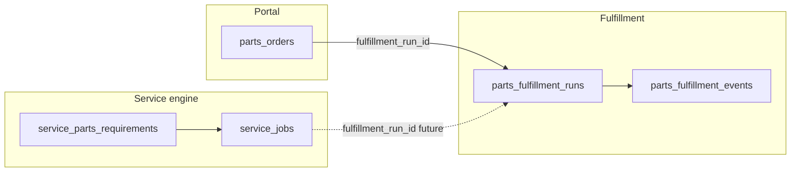

# Parts & Service — Unified Fulfillment Model (ADR)

## Purpose

Align **portal parts demand** (`parts_orders`) with **internal service parts execution** (`service_parts_requirements`, `service_parts_actions`, inventory) under one auditable fulfillment lifecycle without replacing the existing service engine.

## Decision (Phase 1)

**Option A — Canonical fulfillment record:** Introduce `parts_fulfillment_runs` as the parent record for cross-surface parts fulfillment. Portal orders attach at submit time; service jobs may attach in a later phase when the same run should coordinate shop picks and portal shipments.

## Current state (truth model)

| Surface | Tables | Role |
|--------|--------|------|
| Portal | `parts_orders`, line_items JSON | Customer demand, statuses draft → shipped |
| Service engine | `service_jobs`, `service_parts_requirements`, `service_parts_actions` | Internal job-based parts orchestration |
| Bridge (existing) | `service_requests.service_job_id`, `portal_quote_reviews.service_quote_id` | Portal ↔ internal links for service quotes |

**Gap:** `parts_orders` did not link to a shared fulfillment parent before migration `115_parts_fulfillment_and_profile_workspaces.sql`.

## Target relationships

- **Phase 1:** Create `parts_fulfillment_runs` on portal submit; set `parts_orders.fulfillment_run_id`; append `parts_fulfillment_events` (`portal_submitted`, …).
- **Later:** Optional `service_jobs.fulfillment_run_id` when a job and portal order should share one run (e.g. counter pickup + job consumption).

## Staff notifications

**Problem:** In-app staff bells must respect **workspace**, not every `rep`/`admin` globally.

**Mechanism:** `profile_workspaces (profile_id, workspace_id)` — backfilled from all profiles (`default`) and `technician_profiles` (per-workspace tech rows). Portal `portal-api` resolves recipients by joining eligible roles to `profile_workspaces` for `portalWorkspaceId`.

## Boundaries

- No removal of `service_parts_*` tables; fulfillment runs are an overlay for traceability and future convergence.
- RLS: new tables follow `workspace_id = get_my_workspace()` for authenticated staff; `service_role` for edge functions.
- API: portal continues to use `portal-api` only for customer mutations.

## References

- Migration: `supabase/migrations/115_parts_fulfillment_and_profile_workspaces.sql`
- Portal bridge: `supabase/migrations/100_service_portal_bridge.sql`
- Parts intelligence: `supabase/migrations/095_service_parts_vendor_tables.sql`
