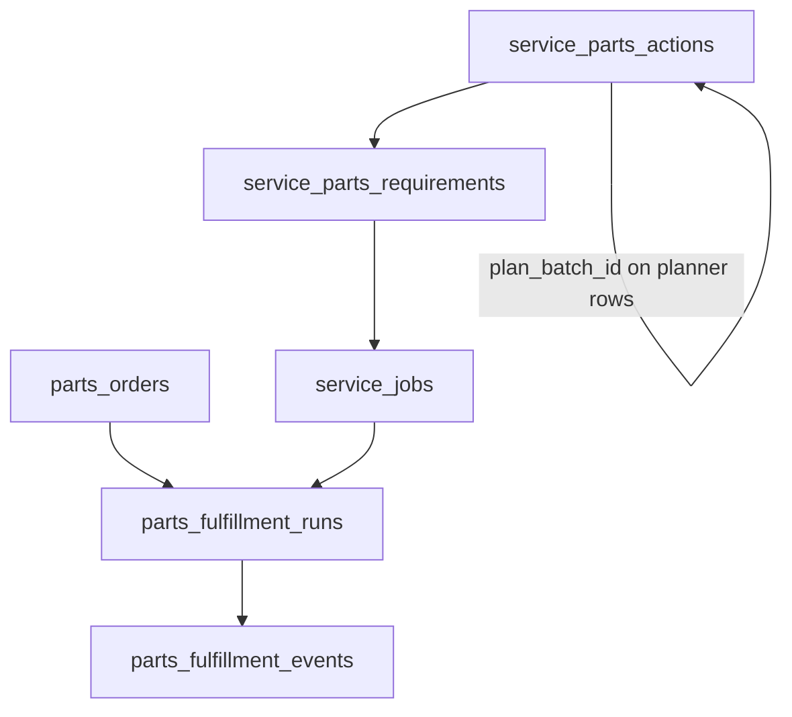

# Parts & Service — Unified Architecture Spec (Deliverable 1)

Companion to the ADR: [parts-service-unified-model.md](./parts-service-unified-model.md).

## Canonical object model

| Entity | Primary table | Notes |
|--------|---------------|--------|
| Fulfillment run | `parts_fulfillment_runs` | Cross-surface parent for audit and lifecycle (`status`: open → submitted → … → closed/cancelled). |
| Fulfillment audit | `parts_fulfillment_events` | Append-only; `event_type` + `payload` JSON. |
| Portal demand | `parts_orders` | Customer lines in JSON; `fulfillment_run_id` set on submit. |
| Shop demand | `service_parts_requirements` | Per `service_job_id`; drives picks/orders/staging. |
| Shop actions | `service_parts_actions` | Atomic picks/receives/stages/consumes; planner rows carry `plan_batch_id` for supersession batches. |
| Service job | `service_jobs` | Optional `fulfillment_run_id` when shop work shares a run with portal/counter. |
| Staff ↔ workspace | `profile_workspaces` | Who receives workspace-scoped notifications. |

## Status machines (summary)

### `parts_orders.status`

`draft` → `submitted` → `confirmed` → `processing` → `shipped` → `delivered`; `cancelled` from several states. Internal UI: [PortalPartsOrdersPage](../../apps/web/src/features/service/pages/PortalPartsOrdersPage.tsx) restricts transitions.

### `parts_fulfillment_runs.status`

Check constraint in migration 115: `open`, `submitted`, `picking`, `ordered`, `shipped`, `closed`, `cancelled`. Portal submit sets `submitted`; DB trigger on `parts_orders` updates run on ship/deliver/cancel (migration 117).

### `service_parts_requirements.status`

See migration 095 and updates from `service-parts-manager` / `service-parts-planner` (e.g. `pending`, `picking`, `ordering`, `received`, `staged`, `consumed`, …). Transitions enforced in code via `validatePartTransition` in `service-parts-manager`.

## Unification story

- **Portal-only demand:** `parts_orders` → run created at submit → events `portal_submitted`, `order_status_*`.
- **Shop-only demand:** `service_parts_requirements` / `service_parts_actions` without a linked run — no `parts_fulfillment_events` under a run unless staff links the job (`service_jobs.fulfillment_run_id`).
- **Shared run:** Same `parts_fulfillment_runs` row can have both portal `parts_orders` and one or more `service_jobs` with `fulfillment_run_id` pointing at it (same `workspace_id`). **Collision:** multiple jobs may reference the same run; there is no DB uniqueness constraint on `(fulfillment_run_id)` on `service_jobs` — product may later restrict to 1:1 if needed.

## Branch / workspace routing

- Internal API: JWT `get_my_workspace()` for RLS on tables scoped by `workspace_id`.
- Portal: `portal_customers.workspace_id` as `portalWorkspaceId`; staff notifications use `profile_workspaces` ∩ role (`portal-api`).
- `service_jobs` and `parts_fulfillment_runs` must match workspace when linking via `link_fulfillment_run`.

## Integration boundaries

| Client | Edge / path |
|--------|----------------|
| Portal customer | `portal-api` only for mutations |
| Internal staff | `service-job-router`, `service-parts-manager`, `service-parts-planner`, `parts-order-customer-notify` (JWT) |
| Automation / cron | Separate functions; prefer `service_role` where configured |

Vendor-specific edges (`service-vendor-*`) do not yet mirror into `parts_fulfillment_events` (optional follow-up).
