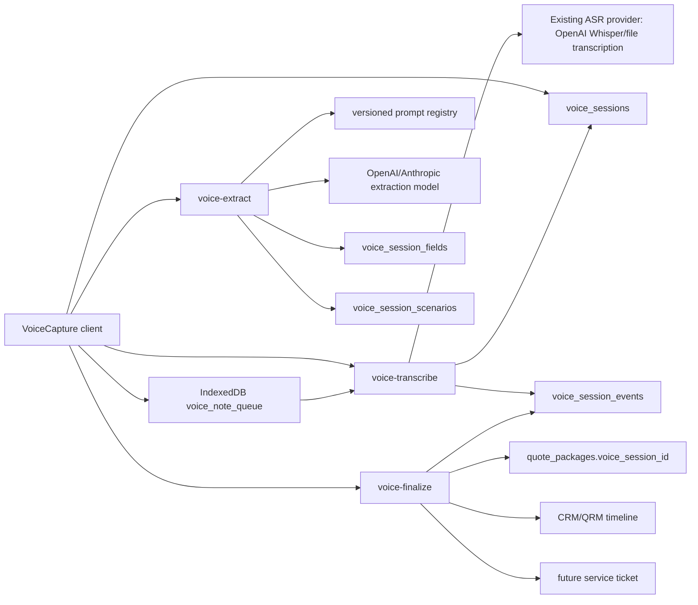

# Voice Platform Backend Plan

Status: Phase 3 approval artifact
Depends on: `docs/voice-platform-data-contract.md`
Scope: Backend architecture, migration plan, gap classification, SQL/RPC/function outlines, latency and cost budgets.
Rule: This plan does not authorize implementation. Do not create migrations, edge functions, frontend platform components, or endpoint removals until this Phase 3 plan is reviewed and approved.

## Current Backend Audit

| Surface | Current function(s) | Current provider path | Current persistence | Notes |
| --- | --- | --- | --- | --- |
| Voice Quote | `voice-to-qrm` then `qb-ai-scenarios` | OpenAI `whisper-1` file transcription; OpenAI `gpt-4o-mini` for QRM extraction; Claude `claude-sonnet-4-6` for scenario intent parse | `voice_captures`, `voice_qrm_results`, `qb_ai_request_log`, eventual `quote_packages.originating_log_id` | Voice Quote borrows QRM transcription and streams scenarios through SSE, but does not persist a replayable voice session. |
| Field Note | `voice-capture`, `voice-capture-sync` | OpenAI `whisper-1` file transcription; OpenAI `gpt-5-mini` chat extraction | `voice_captures.extracted_data`, HubSpot/QRM sync fields, CRM links | Field Note has stronger UX state and offline queue behavior, but storage is feature-specific. |
| Quote Builder voice input | `voice-to-qrm`, `qb-ai-scenarios` | Same as Voice Quote | Session storage handoff plus `quote_packages.originating_log_id` after save | No durable voice session link. |
| Offline sync | `voice_note_queue` IndexedDB + `voice-capture-sync` | Field Note only | Local queue until sync, then `voice_captures` | Voice Quote is not wired to the existing queue. |

Provider facts:

- The repo currently uses OpenAI `audio/transcriptions` with `model = whisper-1`, not Deepgram, AssemblyAI, or Supabase-native ASR.
- Existing transcription is file-upload based. It does not provide true partial token streaming. A new `voice-transcribe` endpoint can stream progress events immediately, but real transcript deltas require a provider mode that supports streaming transcription.
- The current scenario generator uses Claude Sonnet through Anthropic SDK for intent parsing, then deterministic catalog/program logic for scenario construction.

Pricing references used for estimates:

- OpenAI lists Whisper transcription at `$0.006 / minute`; OpenAI also lists newer transcribe models, including `gpt-4o-mini-transcribe` at `$0.003 / minute` and `gpt-4o-transcribe` at `$0.006 / minute`.[^openai-pricing]
- Anthropic lists Claude Sonnet 4.6 batch pricing at `$1.50 / MTok` input and `$7.50 / MTok` output, implying standard interactive pricing of `$3 / MTok` input and `$15 / MTok` output. Anthropic also states Sonnet 4.6 includes 1M context at standard pricing.[^anthropic-pricing]

[^openai-pricing]: [OpenAI API pricing](https://platform.openai.com/docs/pricing/)
[^anthropic-pricing]: [Anthropic Claude API pricing](https://platform.claude.com/docs/en/about-claude/pricing)

## Target Architecture

Replace the four feature-specific functions with three platform functions. Old functions remain live during migration.



### `voice-transcribe`

Input:

```ts
type VoiceTranscribeRequest = FormData & {
  audio: File;
  session_id: string;
  language?: "en" | "es" | "auto";
  mode: "voice_quote" | "field_note" | "quote_builder" | "service_ticket" | "parts_lookup";
};
```

Output:

```ts
type VoiceTranscribeSseEvent =
  | { type: "status"; session_id: string; status: "uploading" | "transcribing" }
  | { type: "partial"; session_id: string; text: string; offset_ms?: number }
  | { type: "complete"; session_id: string; transcript: string; duration_ms?: number }
  | { type: "error"; session_id: string; code: string; message: string; retryable: boolean };
```

Responsibilities:

- Authenticate user with the existing ES256-safe internal auth helper pattern.
- Create or load `voice_sessions`.
- Upload audio to `voice-recordings`.
- Update `voice_sessions.status` through `syncing` / `transcribing` / `ready_for_review`.
- Call current ASR provider first: OpenAI `whisper-1` via `audio/transcriptions`.
- Persist `transcript_raw` and `transcript`.
- Insert `voice_session_events` for upload, transcript, failures, and retry attempts.

Streaming constraint:

- Existing Whisper file upload does not satisfy “first transcript token < 800ms.” It can only emit status/progress SSE until final transcript returns.
- To meet true partial transcript streaming, Phase 4+ needs product approval to switch `voice-transcribe` to a streaming ASR mode such as OpenAI Realtime/transcription models or another provider. This plan does not pick a new provider.

### `voice-extract`

Input:

```ts
type VoiceExtractRequest = {
  session_id: string;
  transcript?: string;
  mode?: VoiceMode;
  force?: boolean;
};
```

Output:

```ts
type VoiceExtractResponse = {
  session_id: string;
  fields: VoiceSessionField[];
  scenarios?: VoiceSessionScenario[];
  status: "ready_for_review" | "needs_review";
};
```

Responsibilities:

- Load session, transcript, and mode.
- Load mode prompt from `supabase/functions/_shared/prompts`.
- Call the approved model for extraction. Initial parity should reuse current providers: OpenAI for Field Note/QRM extraction and Claude only where current Quote Builder scenario intent parsing already requires it.
- Upsert rows into `voice_session_fields`.
- For `voice_quote`, resolve `qb_equipment_models` and write `voice_session_scenarios`.
- Move status through `extracting`, `generating_scenarios`, and `ready_for_review` / `needs_review`.
- Insert events for prompt version, fields extracted, low-confidence fields, scenario generation, and errors.

### `voice-finalize`

Input:

```ts
type VoiceFinalizeRequest =
  | { session_id: string; action: "create_quote_from_scenario"; scenario_id: string }
  | { session_id: string; action: "sync_to_qrm" }
  | { session_id: string; action: "prefill_quote_builder" }
  | { session_id: string; action: "create_service_ticket" }
  | { session_id: string; action: "create_parts_lookup" };
```

Output:

```ts
type VoiceFinalizeResponse = {
  session_id: string;
  status: "completed" | "needs_review";
  downstream: {
    quote_package_id?: string;
    crm_activity_id?: string;
    crm_deal_id?: string;
    service_ticket_id?: string;
    parts_request_id?: string;
  };
};
```

Responsibilities:

- Dispatch by mode and action.
- For Voice Quote, create/update `quote_packages` with `voice_session_id`, selected scenario payload, and `originating_log_id` when available.
- For Field Note, create the QRM timeline activity and preserve existing HubSpot/QRM sync parity.
- For Quote Builder, return normalized form-prefill payload without generating scenarios.
- Mark session `completed` or `needs_review`.
- Insert `scenario_selected`, `finalize_started`, and `finalize_completed` events.

## Prompt Management

Create:

```text
supabase/functions/_shared/prompts/
  voice-extract-voice-quote.md
  voice-extract-field-note.md
  voice-extract-quote-builder.md
  voice-extract-service-ticket.md
```

Contract:

- Prompts are version-controlled and changed only through PRs.
- Each prompt declares: mode, output JSON schema, field names, confidence rules, and examples.
- `voice-extract` logs `prompt_name`, `prompt_sha`, model, token usage, and response shape into `voice_session_events`.
- Future `parts_lookup` gets a new prompt file and mode config, not a forked backend pipeline.

## Migration Plan

### PR 1: Platform schema and new functions, no feature migration

- Add `voice_sessions`, `voice_session_fields`, `voice_session_scenarios`, `voice_session_events`.
- Add `quote_packages.voice_session_id`.
- Add `voice_captures.voice_session_id`.
- Add prompt registry.
- Add `voice-transcribe`, `voice-extract`, `voice-finalize`.
- Keep all old functions live.

### PR 2: Voice Quote migration

- Voice Quote calls new platform endpoints only.
- Persist sessions, fields, and scenarios.
- Keep `voice-to-qrm` and `qb-ai-scenarios` available for rollback but do not call both old and new paths from the same page.

### PR 3: Voice Quote parity hardening

- Verify scenario parity, Quote Builder handoff, recent session replay, and back navigation.
- Add monitoring events and alert thresholds before expanding to Field Note.

### PR 4: Field Note migration

- Field Note calls new platform endpoints only.
- Backfill and dual-read from `voice_sessions`, with `voice_captures` as read-only legacy for one release.
- Keep `voice-capture` and `voice-capture-sync` live for rollback.

### PR 5: Quote Builder voice input migration

- Quote Builder uses `voice-extract` in `quote_builder` mode.
- Retire `features/voice-qrm/VoiceRecorder` only after Quote Builder staging parity.

### PR 6: Old endpoint retirement after 2-week overlap

- Archive `voice-to-qrm`, `qb-ai-scenarios`, `voice-capture`, and `voice-capture-sync` under `_deprecated`.
- Remove old frontend callers only after traffic confirms zero production use.

## Backend Gap Classification

Classification:

- A: READY. Current schema/function can serve it.
- B: AGGREGATION. Needs a view, RPC, or edge-function adapter over existing data.
- C: MISSING. Needs new schema/function/integration.

| Contract item | Class | Backend work |
| --- | --- | --- |
| Workflow status and step mapping | C | `voice_sessions.status`, event writes, status transition guard. |
| Timer, max duration, waveform | A | Client-only or mode config; backend only validates max duration. |
| Live transcript | C | New `voice-transcribe` SSE endpoint; true partials require provider approval. |
| Final transcript and raw transcript | C | `voice_sessions.transcript`, `transcript_raw`. |
| Transcript edit before extraction | C | Owner update path and `transcript_edited` event. |
| Extracted fields and confidence chips | C | `voice_session_fields` plus extraction writes. |
| Field edit pencil | C | Restricted user update and `field_edited` event. |
| Scenario cards and recommended tag | C | `voice_session_scenarios`; current SSE is not durable. |
| Scenario compare modal | B | Can be served from scenario rows once persisted. |
| Open in Quote Builder | C | `voice-finalize` creates `quote_packages.voice_session_id`. |
| Quote Builder voice badge/back link | B | Quote package read must join/lookup session. |
| Try saying examples and sidebars | A | Mode config, no backend. |
| Language indicator | C | `voice_sessions.language`; ASR language hint handling. |
| Offline-ready and queued drafts | B | Existing IndexedDB store; backend needs sync endpoint semantics. |
| Recent Voice Quotes | C | Query `voice_sessions` plus scenarios and quote link. |
| Recent Field Notes | B/C | Dual-read legacy `voice_captures` until backfill; then `voice_sessions`. |
| Recent audio play | B | Storage signed URL for `audio_url`; local blob before sync. |
| Status chips and actions column | C | Status/event/downstream metadata. |
| Field Note match confidence | B/C | Current evidence JSON can map during migration; target fields table required. |
| QRM sync destination | B/C | Existing sync helpers reused behind `voice-finalize`; target metadata/events required. |
| Offline audio preview | A | Local blob only before sync. |

## Required SQL

Migration PR should implement the Phase 2 schema exactly, with these additions.

```sql
-- Guarded transition helper. Edge functions use this before long work.
create or replace function public.transition_voice_session(
  p_session_id uuid,
  p_from_status text[],
  p_to_status text,
  p_event_type text,
  p_payload jsonb default '{}'::jsonb
)
returns public.voice_sessions
language plpgsql
security definer
set search_path = ''
as $$
declare
  v_session public.voice_sessions;
begin
  update public.voice_sessions
  set status = p_to_status,
      updated_at = now(),
      transcribed_at = case when p_to_status = 'ready_for_review' and transcribed_at is null then now() else transcribed_at end,
      extracted_at = case when p_to_status in ('ready_for_review', 'needs_review') and extracted_at is null then now() else extracted_at end,
      completed_at = case when p_to_status = 'completed' then now() else completed_at end
  where id = p_session_id
    and status = any(p_from_status)
  returning * into v_session;

  if v_session.id is null then
    raise exception 'invalid voice session transition';
  end if;

  insert into public.voice_session_events(session_id, event_type, payload)
  values (p_session_id, p_event_type, coalesce(p_payload, '{}'::jsonb));

  return v_session;
end;
$$;

grant execute on function public.transition_voice_session(uuid, text[], text, text, jsonb)
  to service_role;

-- Recent session list for thin frontend queries.
create or replace function public.list_voice_sessions(
  p_mode text,
  p_limit integer default 30,
  p_status text default null
)
returns table (
  id uuid,
  mode text,
  status text,
  language text,
  customer_hint text,
  customer_company_id uuid,
  customer_contact_id uuid,
  audio_duration_ms integer,
  audio_url text,
  quote_package_id uuid,
  scenario_count integer,
  created_at timestamptz,
  updated_at timestamptz
)
language sql
stable
security invoker
set search_path = ''
as $$
  select
    s.id,
    s.mode,
    s.status,
    s.language,
    s.customer_hint,
    s.customer_company_id,
    s.customer_contact_id,
    s.audio_duration_ms,
    s.audio_url,
    qp.id as quote_package_id,
    count(vss.id)::int as scenario_count,
    s.created_at,
    s.updated_at
  from public.voice_sessions s
  left join public.quote_packages qp on qp.voice_session_id = s.id
  left join public.voice_session_scenarios vss on vss.session_id = s.id
  where s.mode = p_mode
    and (p_status is null or s.status = p_status)
    and s.status <> 'archived'
  group by s.id, qp.id
  order by s.created_at desc
  limit least(greatest(p_limit, 1), 100);
$$;

grant execute on function public.list_voice_sessions(text, integer, text)
  to authenticated;
```

Backfill SQL outline:

```sql
insert into public.voice_sessions (
  workspace_id,
  user_id,
  mode,
  status,
  audio_url,
  audio_duration_ms,
  transcript,
  transcript_raw,
  customer_company_id,
  customer_contact_id,
  legacy_voice_capture_id,
  error,
  metadata,
  started_at,
  transcribed_at,
  extracted_at,
  completed_at,
  synced_at,
  created_at,
  updated_at
)
select
  coalesce(to_jsonb(vc)->>'workspace_id', public.get_my_workspace(), 'default'),
  vc.user_id,
  'field_note',
  case vc.sync_status
    when 'synced' then 'completed'
    when 'processing' then 'syncing'
    when 'failed' then 'failed'
    else 'needs_review'
  end,
  vc.audio_storage_path,
  case when vc.duration_seconds is null then null else vc.duration_seconds * 1000 end,
  vc.transcript,
  vc.transcript,
  vc.linked_company_id,
  vc.linked_contact_id,
  vc.id,
  case when vc.sync_error is null then null else jsonb_build_object('message', vc.sync_error) end,
  jsonb_build_object('legacy_voice_capture', vc.extracted_data),
  vc.created_at,
  case when vc.transcript is not null then vc.updated_at end,
  case when vc.extracted_data <> '{}'::jsonb then vc.updated_at end,
  case when vc.sync_status = 'synced' then vc.updated_at end,
  case when vc.sync_status = 'synced' then vc.updated_at end,
  vc.created_at,
  vc.updated_at
from public.voice_captures vc
where vc.voice_session_id is null
  and (vc.transcript is not null or vc.audio_storage_path is not null or vc.extracted_data <> '{}'::jsonb)
on conflict (legacy_voice_capture_id) do nothing;

update public.voice_captures vc
set voice_session_id = s.id
from public.voice_sessions s
where s.legacy_voice_capture_id = vc.id
  and vc.voice_session_id is null;
```

## Edge Function Outlines

### `voice-transcribe/index.ts`

```ts
Deno.serve(async (req) => {
  // 1. OPTIONS / method guard.
  // 2. requireServiceUser(req.headers.authorization).
  // 3. Parse multipart audio, session_id, mode, language.
  // 4. Validate session ownership/workspace and max duration/size.
  // 5. Upload audio to voice-recordings.
  // 6. Emit SSE status events immediately.
  // 7. Call existing OpenAI whisper-1 transcription path.
  // 8. Persist transcript_raw/transcript/audio metadata.
  // 9. Insert voice_session_events rows.
  // 10. Emit complete/error SSE.
});
```

### `voice-extract/index.ts`

```ts
Deno.serve(async (req) => {
  // 1. Auth and JSON body parse.
  // 2. Load voice_sessions row.
  // 3. Refuse extraction if transcript is missing.
  // 4. Load mode prompt by name and prompt SHA.
  // 5. Call current approved model path.
  // 6. Validate JSON with mode schema.
  // 7. Upsert voice_session_fields.
  // 8. For voice_quote: resolve qb_equipment_models and insert scenarios.
  // 9. Set ready_for_review or needs_review.
  // 10. Log prompt metadata, token usage, confidence distribution, and errors.
});
```

### `voice-finalize/index.ts`

```ts
Deno.serve(async (req) => {
  // 1. Auth and JSON body parse.
  // 2. Load session, fields, scenarios, and current downstream links.
  // 3. Dispatch by action.
  // 4. For create_quote_from_scenario, create quote_packages with voice_session_id.
  // 5. For sync_to_qrm, call existing QRM/CRM write helpers.
  // 6. For prefill_quote_builder, return normalized draft payload.
  // 7. Mark completed or needs_review.
  // 8. Log finalization events and downstream IDs.
});
```

## Performance Budget

| Stage | Target | Current-stack assessment | Gap |
| --- | --- | --- | --- |
| ASR first token | `< 800ms` | Current file-upload Whisper path cannot produce true partial transcript tokens. | Missing provider capability or Realtime integration. |
| ASR full transcript | `<= 1.5x audio duration` | Current Whisper path likely acceptable for short recordings but must be measured with production audio. | Add metrics. |
| Extraction | `< 3s` for 2-minute recording | Achievable with one structured model call if prompt stays compact. | Need schema validation and timeout budget. |
| Scenario generation | `< 5s` | Current `qb-ai-scenarios` target says first card `<10s`, full set `<60s`; deterministic scenario build is fast, but Claude parse and catalog lookup must be measured. | Optimize parse and avoid second LLM call. |
| Stop-to-scenarios | `< 10s` for 60 seconds | Not guaranteed on current file-upload ASR plus scenario SSE. | True streaming ASR or earlier extraction start needed. |

## Cost Budget

Assumptions for a 60-second Voice Quote:

- ASR: 1 minute Whisper at `$0.006`.
- Extraction prompt: 2,000-4,000 input tokens and 800-1,500 output tokens.
- Scenario intent parse: existing Claude Sonnet 4.6 path, 1,500-3,000 input tokens and 300-800 output tokens.
- Scenario calculations: deterministic DB/RPC work, no model cost.

Estimated current-stack cost:

| Component | Estimate |
| --- | --- |
| ASR | `$0.006` |
| Field extraction with compact OpenAI mini model | `< $0.01` typical |
| Claude Sonnet intent parse for scenarios | `$0.01 - $0.03` typical |
| Total 60-second Voice Quote | `$0.02 - $0.06` typical |
| Total 2-minute Field Note | `$0.02 - $0.05` typical |

The `$0.20/session` target is feasible on current model classes if:

- Extraction uses one compact prompt per mode.
- Voice Quote does not call both `voice-to-qrm` and `qb-ai-scenarios` after migration.
- Scenario generation remains deterministic after one parse/extraction call.
- Prompt/event logging stores payloads but does not trigger extra model calls.

Cost risks:

- True real-time ASR can change pricing if implemented through a realtime audio-token model rather than file transcription.
- Prompt bloat or multi-pass extraction can push complex sessions above budget.
- Data residency multipliers or priority/fast tiers increase vendor cost.

## Observability Requirements for Phase 8 Compatibility

The new functions must emit enough event data for later metrics without retrofitting.

Minimum `voice_session_events.payload` fields:

- `stage`
- `latency_ms`
- `provider`
- `model`
- `prompt_name`
- `prompt_sha`
- `input_tokens`
- `output_tokens`
- `audio_duration_ms`
- `estimated_cost_usd`
- `error_code`
- `retryable`

Existing observability:

- Sentry helper exists in edge functions.
- Supabase logs exist.
- No first-class Datadog/Axiom metrics client was found in the voice path. Treat external observability as a Phase 8 decision.

## Backend Approval Questions

1. Approve current-provider parity first: OpenAI Whisper/file transcription remains v1 ASR, while the plan flags true partial streaming as a provider gap.
2. Approve `workspace_id`/CRM-compatible schema from Phase 2 as the migration source of truth.
3. Approve service-role-only writes for extraction/scenario/event rows, with user-owned update only for transcript and editable extracted fields.
4. Approve old endpoint overlap for at least two weeks after all callers move to the new endpoints.
5. Decide whether Phase 4 UX may show progress-only SSE during transcription if true transcript deltas are not approved yet.

## Approval Stop

Phase 3 is complete when this backend plan is reviewed and accepted. Do not begin Phase 4 shared frontend infrastructure, schema migrations for `voice_sessions`, or new consolidated edge functions until this plan is approved.
